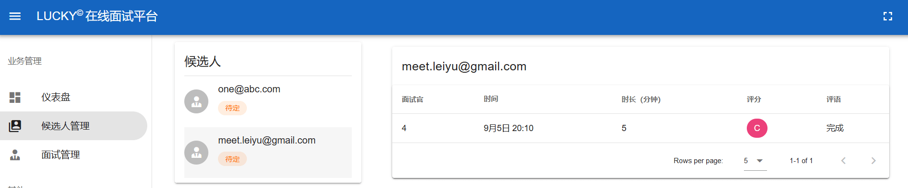
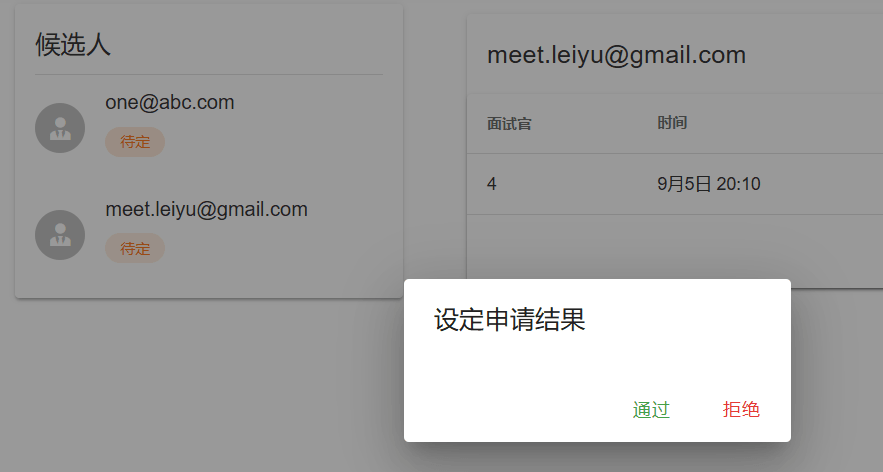
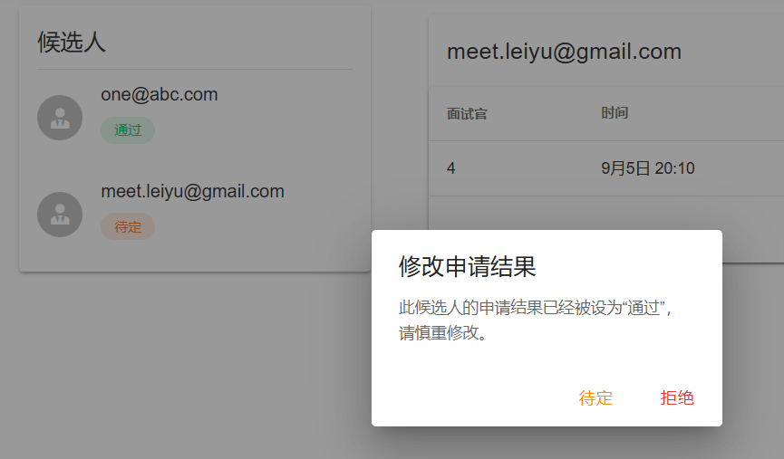
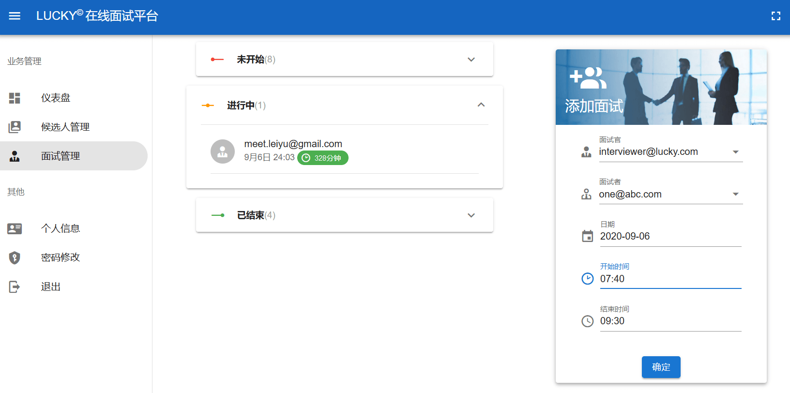

# HR

HR 有需要筛选的候选人，有可以分配的面试官（这二者都是由超管分配的）。HR 的任务就是利用手里的面试官来筛选候选人。

## 候选人管理

### 观察表现

在候选人管理页面，点击候选人列表中的候选人，则会在右侧的面试列表中看到此候选人每场面试的时间、时长、面试官、评分和评语。

### 设定状态
根据在面试列表中观察到的候选人的表现，HR 可以点击候选人的状态来设定这位候选人的状态。（状态只能是“待定”、“通过”或“拒绝”其中之一）

## 面试管理

在面试管理页面，HR 可以旁观或回溯面试，可以添加面试。

### 旁观或回溯面试

点击“进行中”的面试，即可进入房间旁观面试，但不能干预。

点击左侧“已结束”的面试，即可进入房间回溯面试过程，回溯时可以看到面试过程的文字聊天、白板、代码、视频。

### 添加面试

在右侧选择面试官、面试者（即候选人）、面试时间，点击“确定”，即可添加一场新面试。

如果分配给此面试官的任务不在他的空闲时间内，或他有其他面试任务与新任务重叠，或有其他任务与新任务间隔不到 10 分钟，那么添加新面试失败，会弹出相应的提示信息。