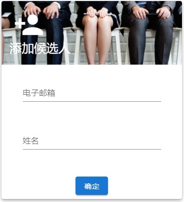
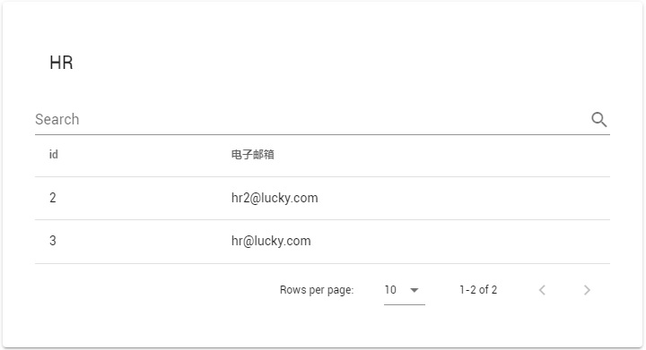
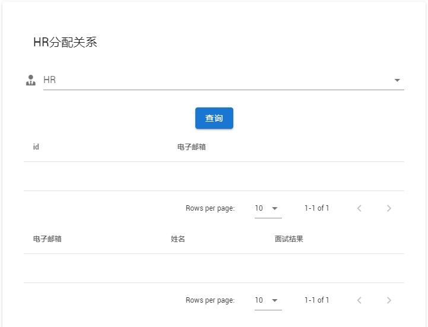
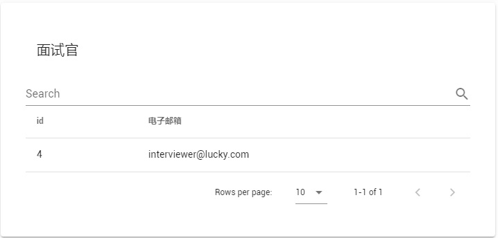
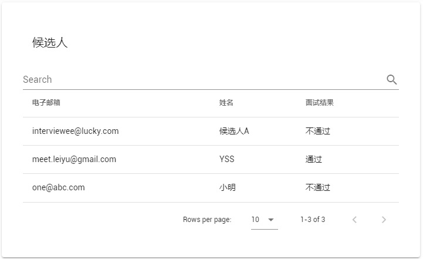

# 管理员

管理员是整个在线面试平台的最高管理者，只有一人。

管理员有账号、可登录。在数据库初始化的时候设置其用户名、密码。

管理员可添加 HR、面试官、候选人（前两者可以手动导入，最后一个可以从 CSV 文件、Excel 文件导入）。

管理员可给 HR 分配需要筛选的候选人，一个候选人只能分给一个 HR；也给 HR 分配其可用的面试官，一个面试官可分给多个 HR。

管理员可以查询所有HR、面试官和候选人，可以查询分配给某个HR的面试官和候选人。

## 管理 HR

- 分配候选人：给HR分配候选人。根据HR的邮箱选择一位HR，根据候选人的邮箱选择一位候选人，点击确定进行分配。操作成功或失败会弹出相关信息提示。


- 分配面试官：给HR分配面试官。根据HR的邮箱选择一位HR，根据面试官的邮箱选择一位面试官，点击确定进行分配。操作成功或失败会弹出相关信息提示。


- 添加HR：输入HR的电子邮箱和HR在面试系统的登录密码，点击确定添加HR。操作成功或失败会弹出相关信息提示。


## 管理面试官

- 添加面试官：输入面试官的电子邮箱和面试官在面试系统的登录密码，点击确定添加面试官。操作成功或失败会弹出相关信息提示。


## 管理候选人

- 添加候选人：输入候选人的电子邮箱和候选人姓名，点击确定添加候选人。操作成功或失败会弹出相关信息提示。



- 批量上传候选人：


  - CSV文件：可以含列名或不含列名；每行含有一个候选人的信息，为电子邮箱和姓名。两样信息的先后次序不限。文件示例：
  
    ```csv
    email, name
    "jackweller@gmail.com", "Jack Weller"
    "yusanshi@163.com", "Yusanshi"
    "anothertest@gmail.com", "another test"
    "fortest@126.com", "for test"
  "reversed", "reversed@gmail.com"
    ```

  - Excel文件：支持.xls, .xlsx后缀文件。第一行为列名email和name；第二行开始每行含有一个候选人的信息，分别是电子邮箱和姓名。文件示例：
  
    | email                 | name         |
    | --------------------- | ------------ |
    | jackweller@gmail.com  | Jack Weller  |
    | yusanshi@163.com      | Yusanshi     |
    | anothertest@gmail.com | another test |
    | fortest@126.com       | for test     |

## 查询 HR

- 查询HR：页面自动加载出全部HR的信息（id和电子邮箱），可以通过搜索栏根据任意关键字搜索相关的HR。



- 查询HR分配关系：根据HR的电子邮箱选择一位HR，点击查询，下面的表会分别显示出分配给该HR的面试官信息（id和电子邮箱）和候选人信息（电子邮箱，姓名和面试结果）。



## 查询面试官

- 查询面试官：页面自动加载出全部面试官的信息（id和电子邮箱），可以通过搜索栏根据任意关键字搜索相关的面试官。



## 查询候选人

- 查询候选人：页面自动加载出全部候选人的信息（电子邮箱，姓名和面试结果），可以通过搜索栏根据任意关键字搜索相关的候选人。

