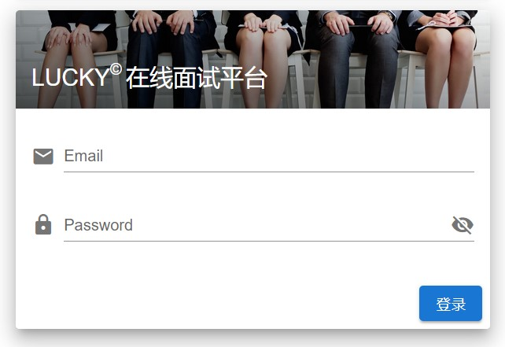
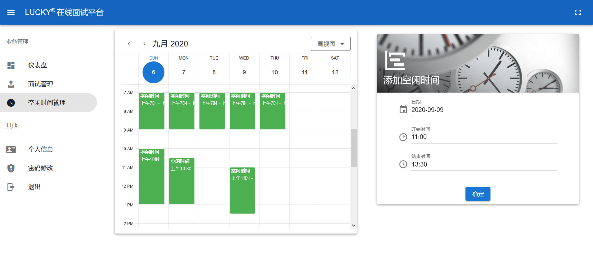
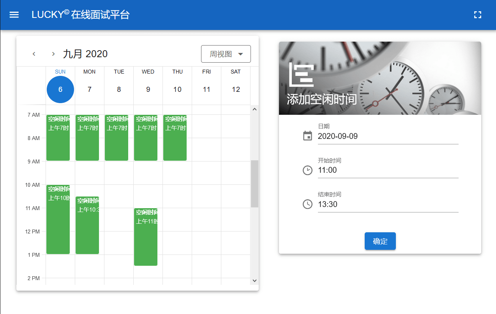
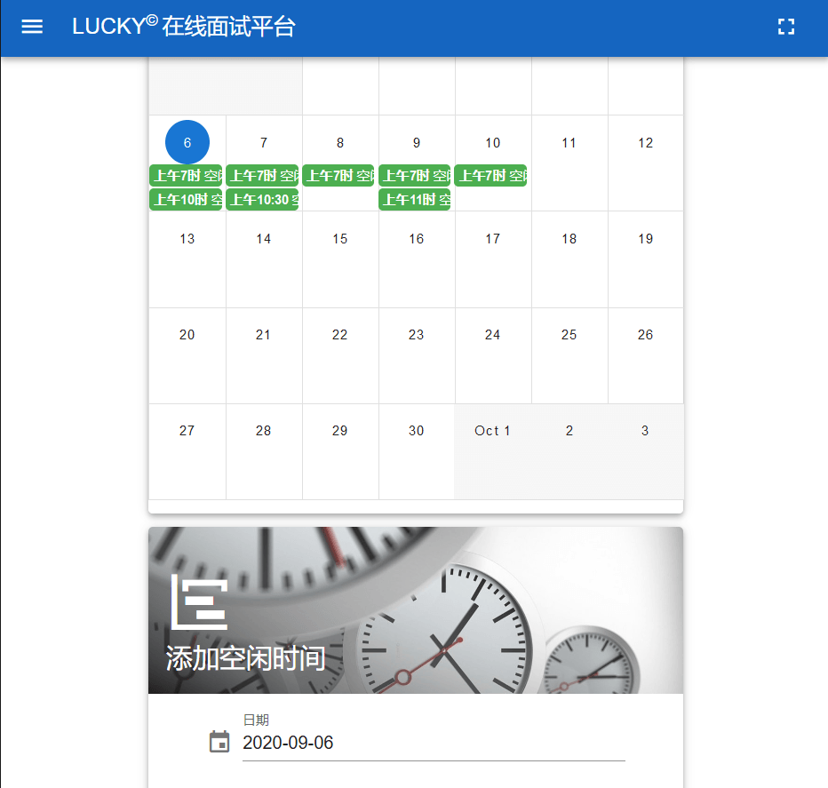
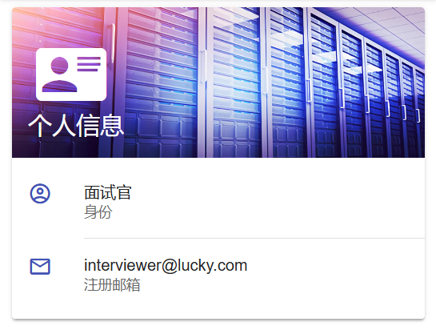
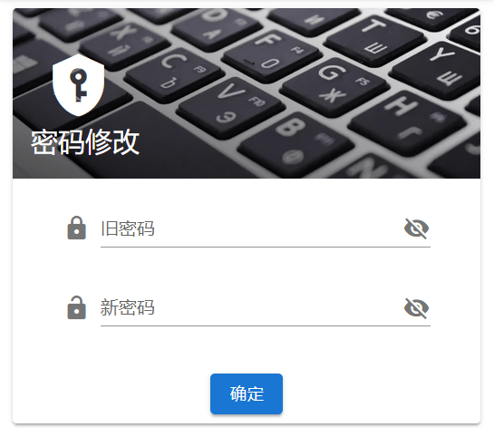

# 通用部分

通用部分介绍的是管理员、面试官和 HR 都会使用到的页面与功能。

## 登陆

管理员、面试官和 HR 使用同样的登陆界面。输入邮箱和密码后登录。

## 控制台

不同角色的控制台大致结构相同，左侧为导航栏，选中导航栏中的不同项目，在右侧显示相应内容。对于支持全屏功能的浏览器，可以点击右上角图标开启全屏。

在不同大小的屏幕上，自动采用合适的页面布局以更好地展示内容。

## 个人信息

在个人信息页面，可以查看自己的一些信息，例如身份、注册邮箱等。

## 修改密码

在修改密码页面，可以修改自己的密码。

